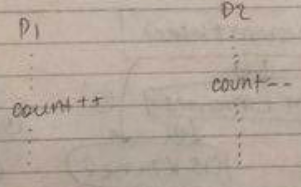

What is inside a Computer System?  
  * hardware
  * software
  * data
  * users

Layers of a computer system  
  * Applications (users and utilities)
  * Libraries
  * OS kernel
  * hardware

1) Applications use libraries  
1') Libraries can access OS kernel  
2) Applications can accesses OS kernel directly  
3) applications can access hardware

unix/linux: 1, 1'  
windows: 2  -   this makes it so that if you change kernel, then application must be changed as well. This is why windows is bad.
both: 3 - assembly programming. nonprivileged instructions.

##### mode bit    
Determines whether the current instruction is for user or for kernel. If user mode, then we check whether current user can do whatever action it wants to do. Kernel mode allows you to functions where the kernel is affecting the hardware. All other things are within user mode.

#### read(file1, block, mm)
This simple seeming read function actually does a lot of stuff. Note that the shell is in user mode in this example. The layers of abstractions are:
* compute position of block
* move read/write head to corresponding disk track
* check for seek errors
* read physical block into buffer
* check for read errors
* copy block to mm from the buffer

#### virtualization
Virtualization involves organizing processes and processors memory.

An example of virtualization is in the above picture where the original CPU creates 2 virtual CPU's. Each virtual CPU is connected to 1 virtual machine and to 1 printer.

timesharing: sharing computing resources among many users by means of multiprogramming and multi-tasking.

spooling (for printing): a type of buffering for the printer. Placing a print job into a queue for extended or later processing. Thus multiple different processes can write to the queue without waiting and whenever the printer is available, it will go ahead and do the appropriate printing function.

#### instruction level concurrency

Process 1 increments count, while process 2 decrements count.
The assembly for process 1 would look like
* (1) load: r1 <- count
* (2) increment: r1 <- r1+1
* (3) store: count <- r1
The assembly for process 2 would look like
* (1') load: r2 <- count
* (2') decrement: r2 <- r2-1
* (3') store: count <- r2

Assume count is initially 3. If P1 ran then P2 ran, count would be 3. If P2 ran then P1 ran, count would be 3.

Instruction level concurrency is about running the assembly instructions concurrently so they still result in the same answer. This is a difficult thing to do. The above would not work with instruction level concurrency. An example that shows that you cannot just interweave the assembly instructions above is:

(1) (2) (1') (2') (3) (3') which is:
* (1) load: r1 <- count       ; count=3, r1=3
* (2) increment: r1 <- r1+1   ; count=3, r1=4
* (1') load: r2 <- count      ; count=3, r1=4, r2=3
* (2') decrement: r2 <- r2-1  ; count=3, r1=4, r2=2
* (3) store: count <- r1      ; count=4, r1=4, r2=2
* (3') store: count <- r2     ; count=2 , r1=4, r2=2

Thus this interleaving would make count=2 when count should be 3.
