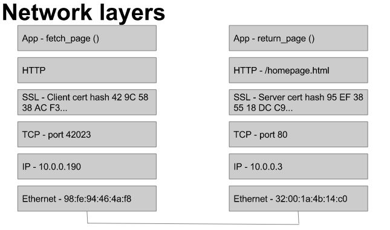
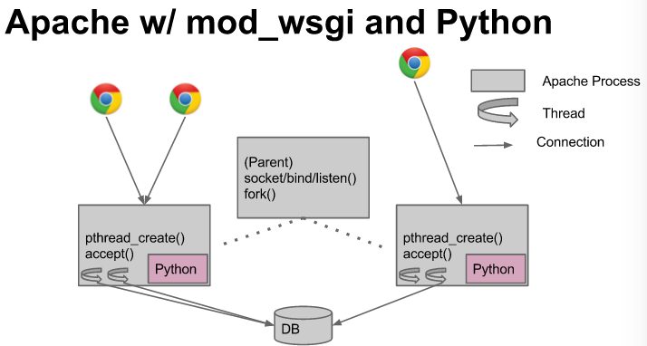

Lecture 2
=============

## HTTP and Networks
Network Layers

Steps for fetching a page
1. Your app makes a fetch_page() request
2. HTTP protocol is used to send request out to real world
3. SSL is used to verify your request
4. TCP is used to connect to server
5. IP is used to determine which CPU on server to connect to
6. Ethernet is used on server

Steps for server to return page
1. Ethernet is used on server
2. IP is used to determine which CPU to connect to
3. TCP is used to connect to requester
4. SSL is used to verify request
5. HTTP protocol (including url) allows server to determine which specific function to run
6. server calls its return_page() function

Ethernet devices have a unique address called a mac address.

## HTTP

HTTP is the main way to send files on internet. Clients send commands to servers. Servers respond to those requests. Servers run commands based on url that request was on. Commands and responses include optional headers.

GET is for asking for information  
POST is for updating data or for forms  

Format of an http url: protocol://host:port/path?args  
An example is www.google.com/?q=stuff
* protocol = www
* host = google.com
* post = default (80)
* path = /
* args = "q=stuff"

## Apache and threading
We are using Apache with mod_wsgi and python

Apache creates a server with a main process. The main apache process runs a bunch of child processes. Each child process is written in python. When requests come in, they are routed to the child processes. Each child process creates a new thread for each request. The threads all concurrently talk to the database.

Each forked process is just a copy of the process that you make. So in our case, when we make our Django application,

Each thread basically performs the following tasks:
1. wait for connection
2. pass to python/django
3. execute python code
4. make db request
5. wait (let other threads run)
6. process DB data
7. return data to client

This method of parallelism is called *"embarrassingly"  parallel* because there is no state sharing between threads besides the database. "Embarrassingly" parallel is also very bad because it pushes all scaling problem to the database.

There is a fixed number of threads. This is bad because there may be more requests than threads at one time. In this case, the threads have to wait.  

The fixed number of threads does allow you to determine max_num_requests / second_for_k_threads

## Model View Controller (MVC)
MVC works, but not always. It should not be coped blindly.  
Apps divided into 3 parts
* Persistent state (models)
* actions (controllers)
* appearance (views)
