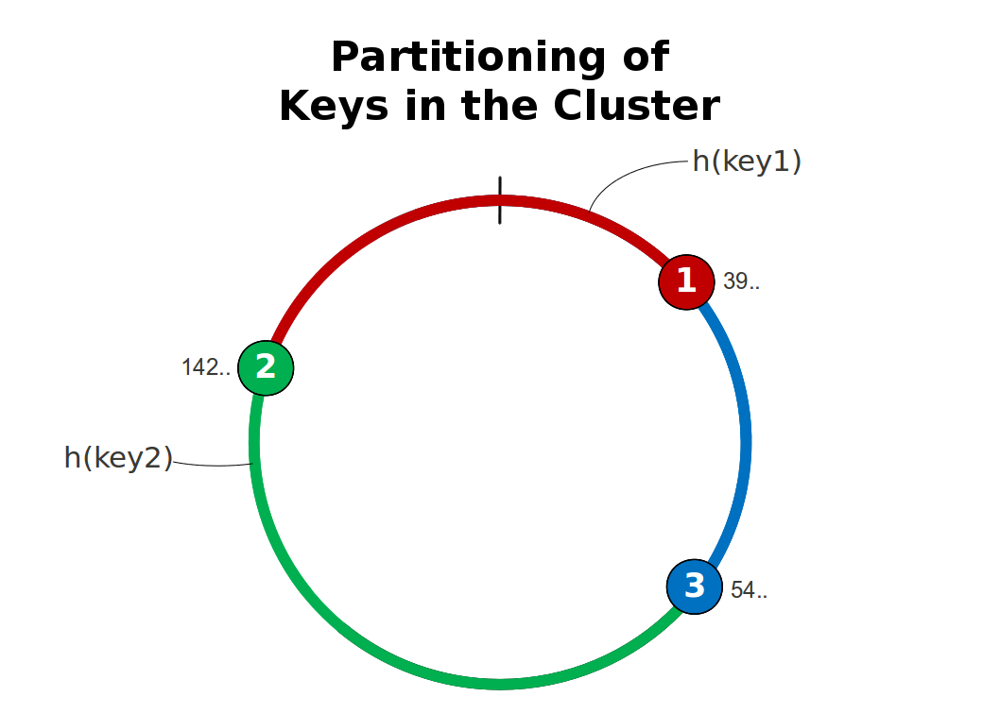

Lecture 6 - Databases, pt2 (cont)
===================================

### Joins
Join = DB term for queries involving multiple tables

A join locks queried rows and sends data between shards

Join can be very slow

Key observations about joins
* you can gain speed using indexes - small bit of data that tells you where to go to to get the data you want
* gain performance through sharding data
  * can put a type of data on a different shard
* gain availability by replicating data
  * usually make copies of data and put them on different continents
* transactions and consistency slow things down
  * logging for commit/rollback
  * multimachine coordination if sharding and replicating data
* joins are expensive to support shards

### Cassandra
design
* sharding: data is sharded by KEY (every row has a unique key)
* replication: each shard can be replicated
* clients HASH key of a row to find which shard it should be stored on
* shards copy the data to their replicas
  * maybe shard responds to a client write once one replica is update, maybe it waits until all replicas update
* every time has a time stamp to aid in creating a consistent timeline of writes
* data logged, not updated
  * new values stored are appended, not updated over values
  * rows not stored contiguously

challenges
* cluster changes happen without letting all clients/servers know about the changes
  * leads to clients not knowing which shard to read from / write to
* scaling cluster up/down
  * add/remove more servers
  * consistent hashing used to minimize data movement
* read throughput hurt by fragmentation (ut high write throughput)

##### How does Cassandra store rows?

Cassandra is a ring. It puts all its nodes in a ring. (1, 2, 3 in pic)

Each node has a node id.(1, 2, 3). Each row that you want to store has a primary key (key1, key2).

There is a single hash function. You use the same hash function for hash(node id) and hash(primary key).

When you hash(primary key) of a row, you store it on the node that has the hash(node id) that is right below it

In the image,
NODES:
* h(1) = 39
* h(2) = 142
* h(3) = 54
ROWS:
* h(key1) = some number between 0 and 39 thus this row is stored on the closest machine which in this case is 1.
* h(key2) = some number between 54 and 142 thus this row is stored on machine 2
