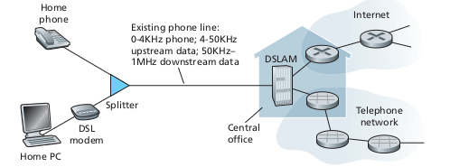

Computer Networks and the Internet
==============

## What is the Internet ?

### Nuts and Bolts
The Internet is the computer network that interconnects millions of computing devices throughout the world.
#### Internet versus internet (upper versus lower 'i')
  * Internet (uppercase) is whole world
  * internet (lowercase) is smaller. Just any bunch of devices that can contact each other.

#### Vocab
* host or end systems
  * each device that a computer network connects to
  * hosts are connected by communication links and packet switches
* communication links
  * a way to connect 2 hosts.
  * made from coaxial cable, copper wire, optical fiber, radio spectrum
* transmission rate
  * transmission rate of a communication link determines the rate at which the link can transmit data from a host to another
  * measure in bits/second
* packets
  * when links send data, they send it in chunks called packets.
  * the data to be transferred is segmented and then each segment is given a header. The packet includes simply a segment and its header.
* packet switch
  * takes a packet arriving on one of its incoming communication links and forwards that packet on one of its outgoing communication links.
  * 2 common types of packet switches are routers and link-layer switches
* link-layer switches
  * typically used in access networks
* routers
  * typically used in network core
* route or path
  * the sequence of communication links and packet switches a packet takes to go from its starting point to destination
* Internet Service Providers (ISP's)
  * hosts access the Internet through ISP's
  * there is a hierarchy of them include:
    * residential (local cable or telephone companies)
    * corporate
    * universities
    * ISP's that provide WiFi in airports, hotels, coffee shops,...
  * Each ISP is a network of packet switches and communication links
  * ISP's provide internet access to both content providers and content consumers
* protocols
  * end systems, packet switches, and other pieces of the internet all run protocols that control the sending and receiving of information within the Internet
  * two common examples are Transmission Control Protocol (TCP) and Internet Protocol (IP). These are so famous and so important that the Internet's principle protocol is considered to be TCP/IP
* Internet Protocol (IP)
  * specifies format of packets that are sent and received among routers and end systems
* Internet standards
  * Because of the importance of protocols, there needs to be standards to how they should be implemented and what exactly they should do.
* Requests for Comments (RFC's)
  * The Internet Engineering Task Force (IETF) creates the standards that everyone on the internet agrees to. The standards are called RFC's

#### Internet = an infrastructure that provides services to applications
The internet can be thought of as an infrastructure that provides services to applications. The applications include things like email, web surfing, social networks, ...

The applications involve multiple different end systems that exchange data with each other. Because of this, they are called *distributed applications.*

End Systems each provide an *Application Programming Interface (API)* that specifies how a program running on one end system asks the Internet infrastructure to deliver data to a specific destination program running on a different end system.

#### Network Edge
Each end system is also called a 'host' because run *application programs* such as web browsers.

There are two types of hosts: *clients* and *servers*. Clients tend to be desktop and mobile devices while servers are more powerful machines that store and distribute web content from large *data centers*.

#### Access Networks

The two most prevalent types of broadband residential access are *digital subscriber line (DSL)* and *cable*. DSL internet access is usually attained from the local telephone company. Thus DSL modems use the existing telephone lines to exchange data with digital subscriber line access multiplexers (DSLAM).

When you have DSL, you are actually using a phone line to connect to the internet. On the customer side, you have a splitter than only recieves telephone data and splits that up between phone and internet data. It also takes in home phone and home internet data sends it view the phone line. On the telephone company side, DSLAM converts between telephone and internet messages. 

#### Local Area Network (LAN)
* ethernet
* mac number is used to identify each host
* everyone is going to get ... but only one keeps it

#### Wide Area Network (WAN)
Lots of LAN's put together. WAN = collection of LAN's. Examples include countries, state, school, ...

##### Point to Point WAN
WAN connects numerous routers together. Each router will connect to other networks elsewhere.   

##### Switch WAN
Put switch together. Switch WAN is a combination of Point-to-Point WAN's.
