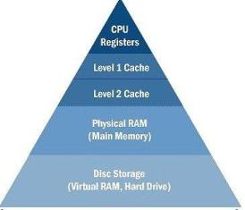

Class 2 Terms
=================

## Caching
data duplicating original resources stored elsewhere on the computer in order to speed up access to those resources
## multilevel cache

multiple levels of cache that get slower, cheaper, and larger in size as you go down the hierarchy
## pipelining
breaking down an instruction into smaller parts in order to run multiple instructions at the same time
## vectorization  
a style of programming where you generalize operations on scalars to apply transparently to vectors.
## loop unrolling
optimize a programs execution speed by making it so that you are doing less overhead work by iterating through the loop less. You do multiple iterations of the work inside a single iteration. This takes advantage of caching.
## code hoisting (also called loop-invariant code motion)
compiler optimization which moves statements or expressions that moves code outside of a loop. Obviously, this code does not actually need to be in the loop in the first place so it is safe to move it out.
## loop invariants
facts/variables/state that does not change over iterations of a loop
## compiler switches and optimization
different optimization options given to a compiler  
## pointer arithmetic
calculations using a pointer. In this scenario, all numbers are multiplied by the size of the pointer.

(a_pointer + a_number)
get changed to
(a_pointer + (a_number * sizeof(* a_pointer)))
because of pointer arithmetic

## SLURM (simple linux utility for resource management)
resource manager for linux clusters.  
Key functions:
 * allocates resources (computer nodes) to specific users for specific durations of time in order for them to do work
 * provides framework for starting, executing, and monitorying work
 * arbitrates contention for resources by managing a queue of pending work  

## ssh (secure shell)
encrypted network protocol to allow remote login and other network services to operation over an unsecured network.
